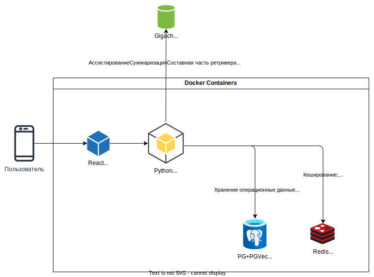

# This is a repository for Moscow Travel Hack 2024 ECom solution of Amazing Digital MISIS team


## Архитектура решения
- [Сайт](https://amazing-digital-misis.ru/) решения
- Сваггер [документация](https://amazing-digital-misis.ru:8000/docs)

#### Диаграмма решения
<br>
Все компаненты контейнерезированы:
- `nginx` - reverse-proxy, роутинг, SSL
- `frontend` - react spa приложение для фронтенда
- `backend` - python backend, использует `fastapi`, `uvicorn`, `sqlalchemy`, `pydantic` и много сложных data-science библиотек
- `redis` - key-value субд
- `postgres` - реляционая СУБД с расширением pg-vector

#### Запуск решения
##### В докере
C ssl
```sh
docker compose up # С SSL
```
Без ssl
```sh
docker compose -f docker-compose-nossl.yaml up
```
Локально
```sh
make frontend-install

make backend-install

make infra-run

make frontend-run # В отдельном терминале

make backend-run # В отдельном терминале
```
